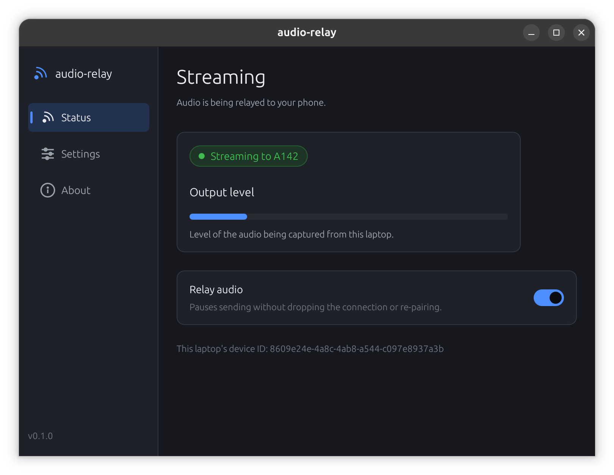
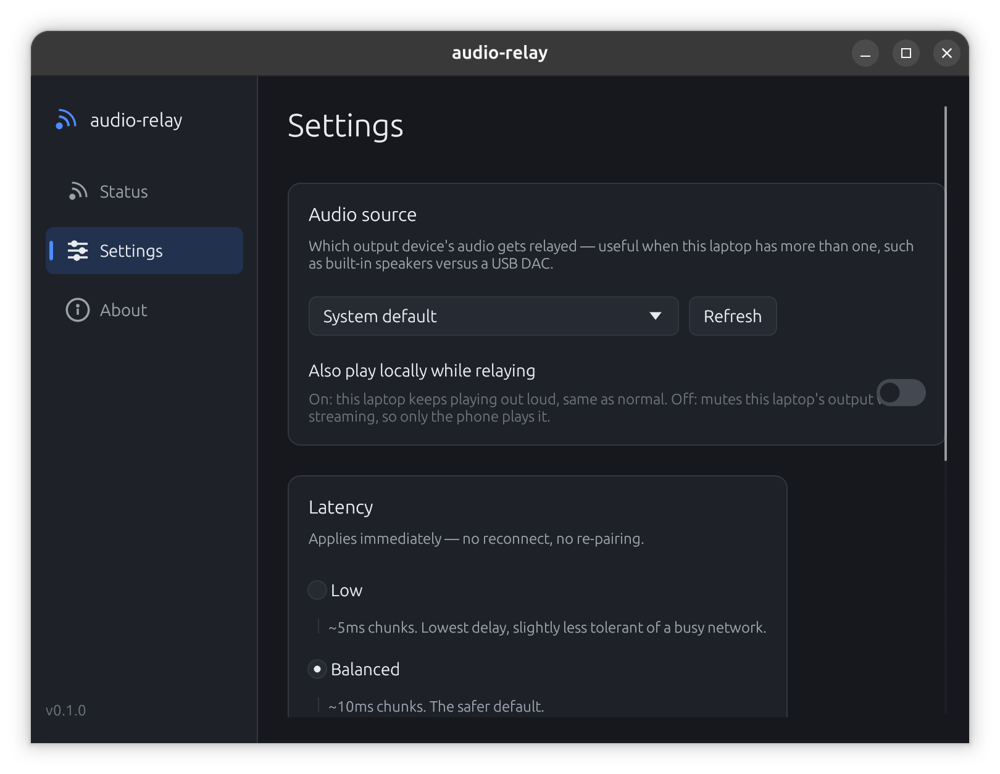
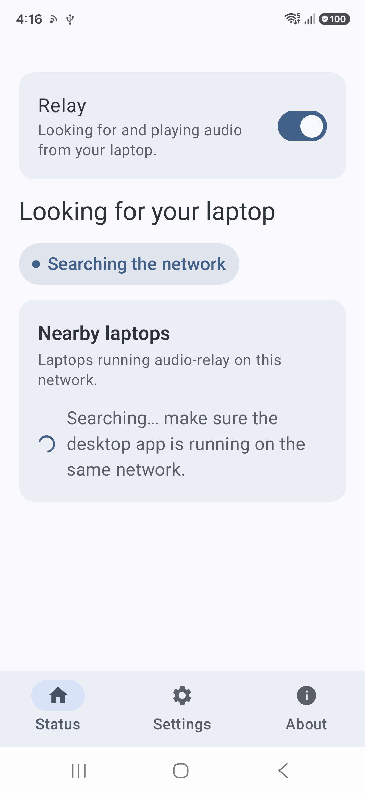

# audio-relay (Flutter Edition)

Low-latency Desktop (macOS / Windows / Linux) → Android audio relay, played back through whatever
Bluetooth device your phone already has connected. 

- **Desktop (macOS / Windows / Linux)**:
  - **macOS**: Native `ScreenCaptureKit` loopback audio capture (PCM 48kHz Stereo 16-bit) with dynamic non-interleaved conversion.
  - **USB / ADB Fast Tunneling**: Built-in automatic `adb reverse` supervisor (`tcp:45108` & `tcp:45109`) for zero-latency, rock-solid cable streaming.
  - **LAN / Wi-Fi**: UDP low-latency transport with ChaCha20-Poly1305 encryption and dynamic 6-digit pairing code verification.
- **Android**:
  - Flutter Material 3 Dashboard.
  - Native Foreground Audio Service with `AudioTrack` low-latency mode (`PERFORMANCE_MODE_LOW_LATENCY`), dynamic jitter buffer, and audio level metering.

```
macOS / Desktop                           Android Phone
┌──────────────────────────┐               ┌────────────────────────────┐
│ ScreenCaptureKit         │   TCP / UDP   │ Low-Latency Audio Receiver │
│  → PCM 48kHz Stereo 16bit│──────────────▶│  → Jitter Buffer           │
│ TCP 45108 (Control/Pair) │◀─────────────▶│  → AudioTrack (Low Latency)│
│ TCP 45109 / UDP 45108    │   ADB / Wi-Fi │  → Bluetooth Earbuds / A2DP│
└──────────────────────────┘               └────────────────────────────┘
```

## Screenshots

|  |  |  |
|---|---|---|
|  |  |  |
| Desktop — ready to pair | Desktop — streaming | Desktop — settings |
|  |  |  |
| Android — Home | Android — Settings | Android — About |

More in the [user guide](docs/user-guide.md).

## Status

Early, active development. `v0.1.0` is the first end-to-end feature set —
see [`CHANGELOG.md`](CHANGELOG.md) for exactly what it includes and
[`docs/roadmap.md`](docs/roadmap.md) for the phased build plan and what's
still ahead. Several hardware-dependent assumptions (WASAPI on real
Windows, `AudioTrack` → A2DP routing, mDNS over an Android hotspot) are
implemented against the documented APIs but not yet confirmed on physical
devices — see `docs/roadmap.md` Phase 0. Treat this as a working, tested
scaffold, not yet a polished release.

## Using it

Already have a build (or grabbed one from
[Releases](https://github.com/JeelGajera/audio-relay/releases))? See the
**[user guide](docs/user-guide.md)** for installing, pairing, and every
setting on both apps, plus troubleshooting.

## Why this exists

Full rationale, the alternatives that were considered and rejected, and the
honest latency budget live in [`docs/architecture.md`](docs/architecture.md).
Short version: Bluetooth A2DP itself adds ~100–200ms, and no software on
either end can remove that. This project's job is to not add much on top of
it — realistic end-to-end latency is in the **~150–290ms** range, which is
fine for video/music/meetings and not intended for competitive gaming.

## Project layout

```
audio-relay/
├── audio_relay_flutter/ # Flutter application
│   ├── android/         # Android runner & Kotlin native audio playback service
│   ├── macos/           # macOS runner & Swift ScreenCaptureKit capture server
│   ├── windows/         # Windows runner & C++ WASAPI capture server + mDNS
│   └── lib/             # Cross-platform Flutter UI
├── protocol-spec.md     # Canonical wire protocol — keep all implementations in sync
├── .github/workflows/   # CI workflows (Android APK & Windows build)
└── docs/
    ├── user-guide.md    # Install, pair, settings, troubleshooting
    ├── architecture.md  # Design rationale, latency budget
    ├── roadmap.md       # Phased build plan
    └── screenshots/
```

## Building

All platforms are built from within the `audio_relay_flutter` project directory using the standard Flutter toolchain:

### Prerequisites
- Flutter SDK (stable channel)
- Platform toolchain:
  - **Android**: Android SDK & JDK 17+
  - **macOS**: Xcode & macOS 13+ SDK
  - **Windows**: Visual Studio 2022 with C++ Desktop Development

### Commands

```sh
cd audio_relay_flutter
flutter pub get

# Android APK
flutter build apk --release

# macOS Application
flutter build macos --release

# Windows Executable
flutter build windows --release
```

## Contributing

Contributions are welcome — see [`CONTRIBUTING.md`](CONTRIBUTING.md) for the
workflow, coding standards, and how the phased roadmap maps to good
first-issue-sized work. Please also read
[`CODE_OF_CONDUCT.md`](CODE_OF_CONDUCT.md).

If you're an AI coding agent (or a human using one) working in this repo,
read [`AGENTS.md`](AGENTS.md) first — it has the build/test commands and
repo conventions the human-facing docs don't spell out.

## Security

Found a vulnerability (e.g. in the pairing/encryption handshake)? Please
follow the responsible-disclosure process in [`SECURITY.md`](SECURITY.md)
rather than opening a public issue.

## License

[MIT](LICENSE)
